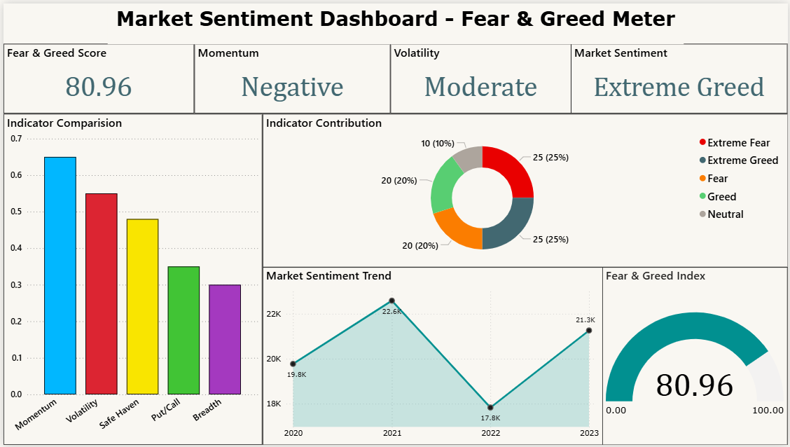

# Fear & Greed Meter Dashboard

## Overview
This project analyzes market sentiment using a Fear & Greed Index created with Python and visualized in Power BI. The index helps understand whether the market is driven by fear or greed using financial indicators such as momentum, volatility, and market strength. The project demonstrates how financial data can be transformed into meaningful insights to support risk understanding and decision making.

## Tools Used
The following tools are used to complete this project:

- Python
- Pandas, Numpy
- Microsoft Excel 
- Jupyter Notebook
- Power BI

## Project Structure
The project is organized in a simple and professional folder structure:

- data → contains the dataset in CSV format
- notebooks → contains Jupyter Notebook used for analysis
- dashboard → contains Power BI dashboard file
- images → contains dashboard preview screenshot
- README.md → project documentation

## Dashboard Features
The dashboard provides clear visualization of market sentiment using:

- Fear & Greed Score card showing overall sentiment value
- Sentiment category indicator (Fear, Neutral, Greed)
- Gauge chart representing sentiment level from 0 to 100
- Trend line chart showing sentiment changes over time
- Indicator contribution chart explaining factor impact
- Sentiment distribution chart for better interpretation

## Dashboard Preview

